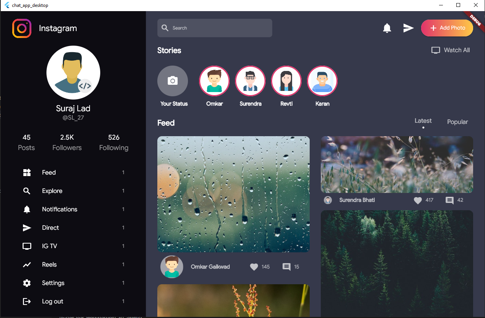

# Instagram Desktop App UI Redesign in Flutter Desktop


Screenshot 

 


## How to use

To clone and run this application, you'll need [Git](https://git-scm.com/downloads) and [Flutter](https://flutter.dev/docs/get-started/install) installed on your computer. From your command line:

```
# Clone this repository
$ git clone https://github.com/SurajLad/InstagramUI-Flutter-DesktopApp.git


# Enable Flutter Desktop SDK
$ visit https://flutter.dev/desktop for more details.

# Go into the repository
$ cd InstagramUI-Flutter-DesktopApp

# Install dependencies
$ flutter packages get

# Run the app
$ flutter run

```
## Credits
  - <a target="_blank" href="https://dribbble.com/shots/10584599-Instagram-Redesign-Desktop-Dark">UI Design By veno for Overlap Studio</a>
  - <a target="_blank" href="https://www.flaticon.com">Graphics By FlatIcons</a>

If you like my work,then do support me by ⭐️ this repo if you like it.
